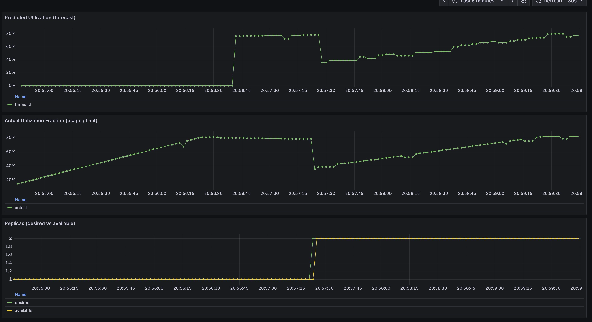

# predictive-scaling
Scale up pods of a kubernetes app using a predictive AI model based on resource utilization

<br/>

# LKE Predictive Autoscaling
End-to-end demo: LKE cluster + Prometheus + KEDA + CPU demo app + predictor (PromQL → model → forecast) + predictive scaling.

<br/>

# Prereqs
- macOS with Homebrew
- `linode-cli`, `kubectl`, `helm`, `jq`, `yq`, `docker`
- Docker registry account (Docker Hub or GHCR)

<br/>

# Create the cluster with the app and predictor
```bash
cp .env.example .env
source .env && make do-all
```

<br/>

# Grafana to visualize and verify
Open a web-browser at http://localhost:3000/login and use the following credentials
```bash
cp .env.example .env
# User
kubectl -n monitoring get secret monitoring-grafana -o jsonpath="{.data.admin-user}" | base64 --decode
# Password
kubectl -n monitoring get secret monitoring-grafana -o jsonpath="{.data.admin-password}" | base64 --decode
```
Go to "Dashboards" on the left pane and then scroll down and select "Predictive Autoscaling — CPU"



You'll notice that:
* The usage steadily rise up in the middle pane and even out at around 80%.
* The predicted usage in the top pane go to 80% as well. The predictor lag window will kick in and at that point the usage will go to half(40%)
* The bottom will show at the same time that the lag window kicks in, the replicas will go from 1 to 2 because by then HPA has picked up on the metrics and then updates the deplpoyment

<br/>

# Cleanup
```bash
cp .env.example .env
source .env && make cleanup
```
